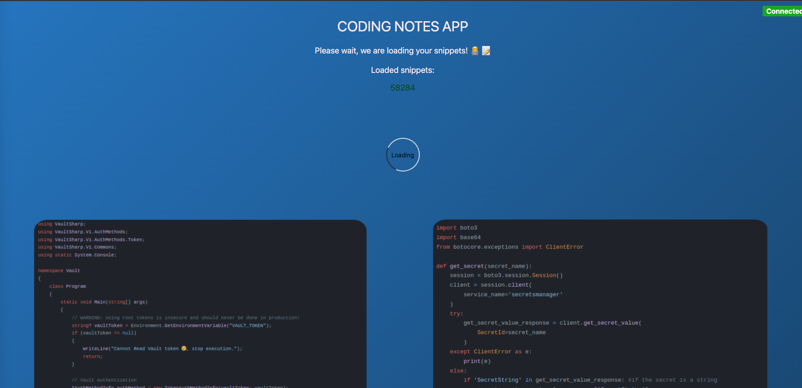

## Krateo Template Microservice
[](https://github.com/krateoplatformops/krateo-template-microservice/actions/workflows/ci.yaml)

This is a template used to deploy a *microservice* with `krateo`:

<div style="width: 65%; height: 65%">

  
  
</div>
<br/>

If you dont override the `Expose application` widget values in `template.yaml` file, the microservice default url is this: https://sample.krateoplatformops.io .

The microservice also implement a prometheus exporter: https://sample.krateoplatformops.io/metrics .

example:  
```console
❯ curl https://sample.krateoplatformops.io/metrics

# HELP python_gc_objects_collected_total Objects collected during gc
# TYPE python_gc_objects_collected_total counter
python_gc_objects_collected_total{generation="0"} 1259.0
python_gc_objects_collected_total{generation="1"} 248.0
python_gc_objects_collected_total{generation="2"} 0.0
# HELP python_gc_objects_uncollectable_total Uncollectable object found during GC
# TYPE python_gc_objects_uncollectable_total counter
python_gc_objects_uncollectable_total{generation="0"} 0.0
python_gc_objects_uncollectable_total{generation="1"} 0.0
python_gc_objects_uncollectable_total{generation="2"} 0.0
# HELP python_gc_collections_total Number of times this generation was collected
# TYPE python_gc_collections_total counter
python_gc_collections_total{generation="0"} 95.0
python_gc_collections_total{generation="1"} 8.0
python_gc_collections_total{generation="2"} 0.0
# HELP python_info Python platform information
# TYPE python_info gauge
python_info{implementation="CPython",major="3",minor="8",patchlevel="16",version="3.8.16"} 1.0
# HELP process_virtual_memory_bytes Virtual memory size in bytes.
# TYPE process_virtual_memory_bytes gauge
process_virtual_memory_bytes 3.7855232e+07
# HELP process_resident_memory_bytes Resident memory size in bytes.
# TYPE process_resident_memory_bytes gauge
process_resident_memory_bytes 3.1010816e+07
# HELP process_start_time_seconds Start time of the process since unix epoch in seconds.
# TYPE process_start_time_seconds gauge
process_start_time_seconds 1.67474724133e+09
# HELP process_cpu_seconds_total Total user and system CPU time spent in seconds.
# TYPE process_cpu_seconds_total counter
process_cpu_seconds_total 0.24000000000000002
# HELP process_open_fds Number of open file descriptors.
# TYPE process_open_fds gauge
process_open_fds 11.0
# HELP process_max_fds Maximum number of open file descriptors.
# TYPE process_max_fds gauge
process_max_fds 1.048576e+06
# HELP flask_exporter_info Information about the Prometheus Flask exporter
# TYPE flask_exporter_info gauge
flask_exporter_info{version="0.20.2"} 1.0
# HELP flask_http_request_duration_seconds Flask HTTP request duration in seconds
# TYPE flask_http_request_duration_seconds histogram
flask_http_request_duration_seconds_bucket{endpoint="coding_notes_app",le="0.005",method="GET",status="200"} 0.0
flask_http_request_duration_seconds_bucket{endpoint="coding_notes_app",le="0.01",method="GET",status="200"} 1.0
flask_http_request_duration_seconds_bucket{endpoint="coding_notes_app",le="0.025",method="GET",status="200"} 1.0
flask_http_request_duration_seconds_bucket{endpoint="coding_notes_app",le="0.05",method="GET",status="200"} 1.0
flask_http_request_duration_seconds_bucket{endpoint="coding_notes_app",le="0.075",method="GET",status="200"} 1.0
flask_http_request_duration_seconds_bucket{endpoint="coding_notes_app",le="0.1",method="GET",status="200"} 1.0
flask_http_request_duration_seconds_bucket{endpoint="coding_notes_app",le="0.25",method="GET",status="200"} 1.0
flask_http_request_duration_seconds_bucket{endpoint="coding_notes_app",le="0.5",method="GET",status="200"} 1.0
flask_http_request_duration_seconds_bucket{endpoint="coding_notes_app",le="0.75",method="GET",status="200"} 1.0
flask_http_request_duration_seconds_bucket{endpoint="coding_notes_app",le="1.0",method="GET",status="200"} 1.0
flask_http_request_duration_seconds_bucket{endpoint="coding_notes_app",le="2.5",method="GET",status="200"} 1.0
flask_http_request_duration_seconds_bucket{endpoint="coding_notes_app",le="5.0",method="GET",status="200"} 1.0
flask_http_request_duration_seconds_bucket{endpoint="coding_notes_app",le="7.5",method="GET",status="200"} 1.0
flask_http_request_duration_seconds_bucket{endpoint="coding_notes_app",le="10.0",method="GET",status="200"} 1.0
flask_http_request_duration_seconds_bucket{endpoint="coding_notes_app",le="+Inf",method="GET",status="200"} 1.0
flask_http_request_duration_seconds_count{endpoint="coding_notes_app",method="GET",status="200"} 1.0
flask_http_request_duration_seconds_sum{endpoint="coding_notes_app",method="GET",status="200"} 0.005120041998452507
flask_http_request_duration_seconds_bucket{endpoint="static",le="0.005",method="GET",status="200"} 1.0
flask_http_request_duration_seconds_bucket{endpoint="static",le="0.01",method="GET",status="200"} 1.0
flask_http_request_duration_seconds_bucket{endpoint="static",le="0.025",method="GET",status="200"} 1.0
flask_http_request_duration_seconds_bucket{endpoint="static",le="0.05",method="GET",status="200"} 1.0
flask_http_request_duration_seconds_bucket{endpoint="static",le="0.075",method="GET",status="200"} 1.0
flask_http_request_duration_seconds_bucket{endpoint="static",le="0.1",method="GET",status="200"} 1.0
flask_http_request_duration_seconds_bucket{endpoint="static",le="0.25",method="GET",status="200"} 1.0
flask_http_request_duration_seconds_bucket{endpoint="static",le="0.5",method="GET",status="200"} 1.0
flask_http_request_duration_seconds_bucket{endpoint="static",le="0.75",method="GET",status="200"} 1.0
flask_http_request_duration_seconds_bucket{endpoint="static",le="1.0",method="GET",status="200"} 1.0
flask_http_request_duration_seconds_bucket{endpoint="static",le="2.5",method="GET",status="200"} 1.0
flask_http_request_duration_seconds_bucket{endpoint="static",le="5.0",method="GET",status="200"} 1.0
flask_http_request_duration_seconds_bucket{endpoint="static",le="7.5",method="GET",status="200"} 1.0
flask_http_request_duration_seconds_bucket{endpoint="static",le="10.0",method="GET",status="200"} 1.0
flask_http_request_duration_seconds_bucket{endpoint="static",le="+Inf",method="GET",status="200"} 1.0
flask_http_request_duration_seconds_count{endpoint="static",method="GET",status="200"} 1.0
flask_http_request_duration_seconds_sum{endpoint="static",method="GET",status="200"} 0.0006793050015403423
flask_http_request_duration_seconds_bucket{endpoint="None",le="0.005",method="GET",status="404"} 1.0
flask_http_request_duration_seconds_bucket{endpoint="None",le="0.01",method="GET",status="404"} 1.0
flask_http_request_duration_seconds_bucket{endpoint="None",le="0.025",method="GET",status="404"} 1.0
flask_http_request_duration_seconds_bucket{endpoint="None",le="0.05",method="GET",status="404"} 1.0
flask_http_request_duration_seconds_bucket{endpoint="None",le="0.075",method="GET",status="404"} 1.0
flask_http_request_duration_seconds_bucket{endpoint="None",le="0.1",method="GET",status="404"} 1.0
flask_http_request_duration_seconds_bucket{endpoint="None",le="0.25",method="GET",status="404"} 1.0
flask_http_request_duration_seconds_bucket{endpoint="None",le="0.5",method="GET",status="404"} 1.0
flask_http_request_duration_seconds_bucket{endpoint="None",le="0.75",method="GET",status="404"} 1.0
flask_http_request_duration_seconds_bucket{endpoint="None",le="1.0",method="GET",status="404"} 1.0
flask_http_request_duration_seconds_bucket{endpoint="None",le="2.5",method="GET",status="404"} 1.0
flask_http_request_duration_seconds_bucket{endpoint="None",le="5.0",method="GET",status="404"} 1.0
flask_http_request_duration_seconds_bucket{endpoint="None",le="7.5",method="GET",status="404"} 1.0
flask_http_request_duration_seconds_bucket{endpoint="None",le="10.0",method="GET",status="404"} 1.0
flask_http_request_duration_seconds_bucket{endpoint="None",le="+Inf",method="GET",status="404"} 1.0
flask_http_request_duration_seconds_count{endpoint="None",method="GET",status="404"} 1.0
flask_http_request_duration_seconds_sum{endpoint="None",method="GET",status="404"} 0.0003080019996559713
# HELP flask_http_request_duration_seconds_created Flask HTTP request duration in seconds
# TYPE flask_http_request_duration_seconds_created gauge
flask_http_request_duration_seconds_created{endpoint="coding_notes_app",method="GET",status="200"} 1.6747473515605247e+09
flask_http_request_duration_seconds_created{endpoint="static",method="GET",status="200"} 1.6747473516825523e+09
flask_http_request_duration_seconds_created{endpoint="None",method="GET",status="404"} 1.6747473519306564e+09
# HELP flask_http_request_total Total number of HTTP requests
# TYPE flask_http_request_total counter
flask_http_request_total{method="GET",status="200"} 2.0
flask_http_request_total{method="GET",status="404"} 1.0
# HELP flask_http_request_created Total number of HTTP requests
# TYPE flask_http_request_created gauge
flask_http_request_created{method="GET",status="200"} 1.674747351560618e+09
flask_http_request_created{method="GET",status="404"} 1.6747473519307518e+09
# HELP flask_http_request_exceptions_total Total number of HTTP requests which resulted in an exception
# TYPE flask_http_request_exceptions_total counter
```
